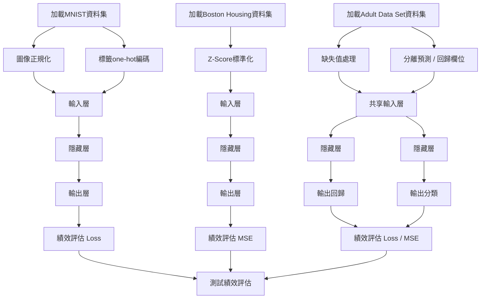

# 機器學習 專案作業一 (第十組)

依賴套件安裝:

```shell
pip install -r requirements.txt
```

## 檔案

* D1.ipynb: MNIST 數字分類
* D2.ipynb: Boston Housing Price 平均房價回歸
* D3.ipynb: Adult Data Set 工時回歸與收入分類


## 組員

* 資訊管理系-M11223045-王仁宏
* 資訊管理系-M11223010-葉哲丞
* 資訊管理系-M11223044-徐嘉佑
* 資訊管理系-M11223050-廖子皓


## 前饋式神經網路超參數影響績效之分析
本研究針對前饋式神經網絡（FNNs）在處理不同類型的資料集上的性 能表現進行了深入分析，旨在探討超參數設定如神經元數量、優化器選擇、激活函數類型以及隱藏層數量對模型預測績效的影響。
透過對 MNIST、Boston Housing Price 和 Adult Data Set 三個具有代表性的資料集進行實證分析

### 神經元數量（units）：
模型隱藏層中的節點數量 
### 隱藏層數量（layers）：
神經網絡中除了輸入層和輸出層之外的層數。增加隱藏層的數量可以增加模型的容量，使其更能夠擬合複雜的數據，但也可能導致過擬合問題。
### 批次數量（batch_sizes）：
指經過批次數量筆資料，更新模型參數一次。

### 訓練週期（epochs）：

將整個訓練數據集通過神經網絡訓練一次稱為一個訓練週期。增加訓練週期的次數可以提高模型的性能，但也可能導致過擬合。通常會通過觀察模型在驗證數據集上的表現來選擇訓練週期的數量。
### 優化器（optimizer）：
調整模型參數以最小化訓練過程中的損失函數，著名的優化 如：AdaGrad、RMSProp、帶動能的 RMSProp 和現今最常見的 Adam。 
### 激活函數（activation Function）：
使用激活函數可以將節點輸出數值限制在一定的範圍或關係 中，還能使模型使用非線性方法程式去解決更複雜的問題，或降低訓練時梯度消失的問題。


# 資料集1：MNIST
| Column Name | Description                                   |
|-------------|-----------------------------------------------|
| pixel1      | 像素值（0到255）                             |
| pixel2      | 像素值（0到255）                             |
| ...         | ...                                           |
| pixel784    | 像素值（0到255）                             |
| label       | 圖像對應的標籤（0到9）                       |
### 參數設定
| 參數           | 單層        | 多層       |
|----------------|------------|------------|
| 輸入層         | 28×28      | 28×28      |
| 隱藏層數量     | 1          | -          |
| 訓練週期       | 50         | 50         |
| 驗證分割比例   | 0.2        | 0.2        |
| 早期停止       | 2          | 2          |
| 輸出層         | Softmax    | Softmax    |
| Loss function | categorical_crossentropy | categorical_crossentropy |
| 批次大小       | 512        | -          |
| 激活函數       | ReLU       | ReLU       |
| 優化器         | Adam       | Adam       |
# 資料集2：Boston Housing
| Column Name | Description                                   | Data       |
|-------------|-----------------------------------------------|-----------:|
| CRIM        | 城鎮犯罪率                                    | 0.006      |
| ZN          | 住宅用地超過 25,000 平方英尺的比例          | 18.000     |
| INDUS       | 非零售業使用的土地面積                        | 2.310      |
| CHAS        | 是否在查爾斯河附近（1 為緊鄰河流，0 反之）   | 0.000      |
| NOX         | 一氧化氮濃度（千萬分之一）                   | 0.538      |
| RM          | 平均的房間數                                  | 6.575      |
| AGE         | 1940 年之前建造的自住房屋的比例              | 65.200     |
| DIS         | 到五個波士頓就業中心的加權距離                | 4.090      |
| RAD         | 到高速公路的方便性指數                        | 1.000      |
| TAX         | 每 10,000 美元的房產稅率                      | 296.000    |
| PTRATIO     | 師生比                                        | 15.300     |
| B           | 黑人比例（使該資料集受到爭議）               | 396.900    |
| LSTAT       | 低收入居民比例                                | 4.980      |
| MEDV        | 房屋價格中位數（單位：一千美元）             | 24.000     |
### 參數設定
| Layer            | Output Shape | Activation function |
|------------------|--------------|---------------------|
| Input: Dense     | 64           | ReLU                |
| Hidden: Dense    | 64           | ReLU                |
| Output: Dense    | 1            | Linear              |

| Hyperparameter   | Value        |
|------------------|--------------|
| Optimizer        | RMSProp      |
| Loss function    | MSE          |
| Epochs           | 80           |
| Batch size       | 16           |
### 資料集3：Adult Data Set
| Column Name  | Description                                                  |
|--------------|--------------------------------------------------------------|
| age          | 年齡                                                         |
| workclass    | 工作類別，例如：私人、州政府、聯邦政府、無薪工作者等       |
| fnlwgt       | 最終權重，根據人口普查數據調整的人口數                       |
| education    | 教育程度，例如：小學、中學、大學、碩士等                     |
| education-num| 教育程度對應的數字                                          |
| marital-status| 婚姻狀況，例如：已婚、未婚、分居等                         |
| occupation   | 職業                                                         |
| relationship | 家庭關係，例如：丈夫、妻子、親自、未婚等                     |
| race         | 種族，例如：白人、黑人、亞洲人等                             |
| sex          | 性別                                                         |
| capital-gain | 資本收益                                                     |
| capital-loss | 資本損失                                                     |
| hours-per-week| 每週工作時數                                                |
| native-country| 原籍國家                                                     |
| income       | 收入是否超過 50K 美元，二元變數： >50K、<=50K               |
### 參數設定
| 參數類別     | 回歸模型     | 分類器     |
|-------------|--------------|------------|
| 隱藏層數量   | 2            | 2          |
| 神經元數量   | [1024,512]   | [42,21]    |
| Drop out    | [0.1,0.05]   | [0.1,0.05] |

| 性能指標     | 分類任務     | 迴歸任務     |
|------------|-----------|------------|
| 分類       | Precision | 0.7662     |
|            | Recall    | 0.62745    |
|            | F1-Score  | 0.6899     |
| 迴歸       | MAE       | 0.161196   |
|            | MAPE      | 0.6787     |
|            | RMSE      | 0.2526     |
### 流程圖

### 評分
分類問題：
$$Accuracy = (TP + TN) / (TP + TN + FP + FN)$$
$$Precision = TP / (TP + FP)$$
$$Recall = TP / (TP + FN)$$
$$F1 Score = 2 * (Precision * Recall) / (Precision + Recall)$$
$$Categorical Cross Entropy（用於多分類任務） = -∑(y_i * log(p_i))$$
回歸問題：
$$MSE = (1/n) * Σ(y_i - ŷ_i)^2$$
$$MAE = (1/n) * Σ|y_i - ŷ_i|$$
$$MAPE = (1/n) * Σ(|y_i - ŷ_i| / |y_i|) * 100%$$
$$RMSE = √(MSE)$$
### 結論
實驗結果顯示，Adam優化器在多個任務中提供了最佳性能，而 ReLU 激活函數由於其非飽和特性，有助於改善模型的學習速度和準確度。此外，合理的神經元數量和隱藏 層數量能夠平衡模型的複雜度和擬合能力，防止過擬合同時保持良好的泛化能力。 數據前處理技術如正規化亦被證明對提升模型性能有顯著效果。
